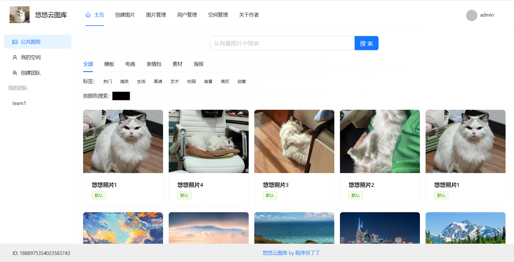
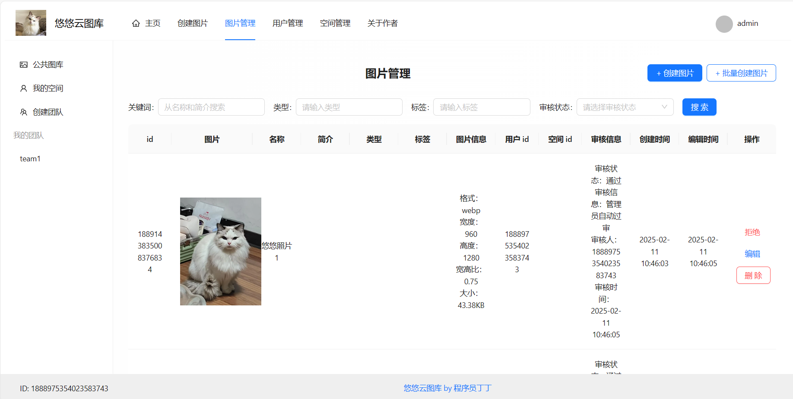
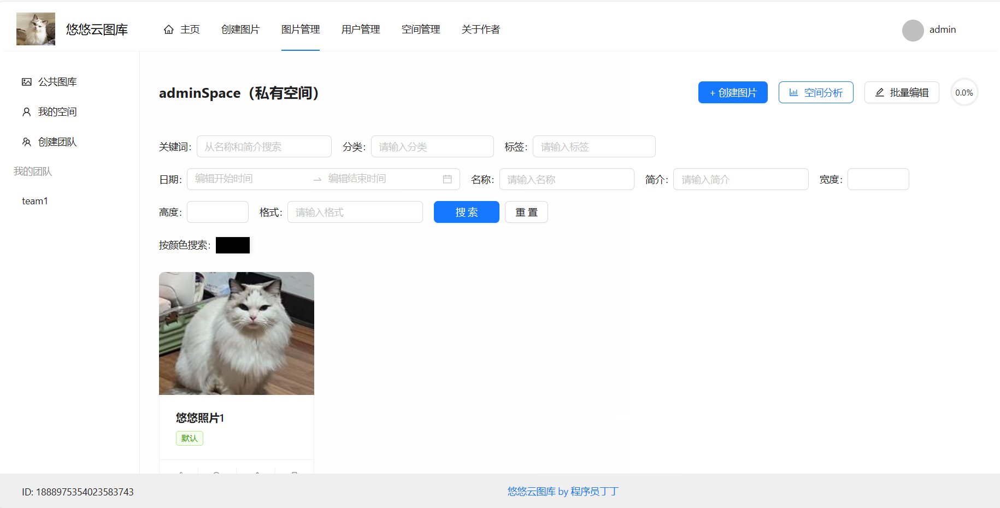
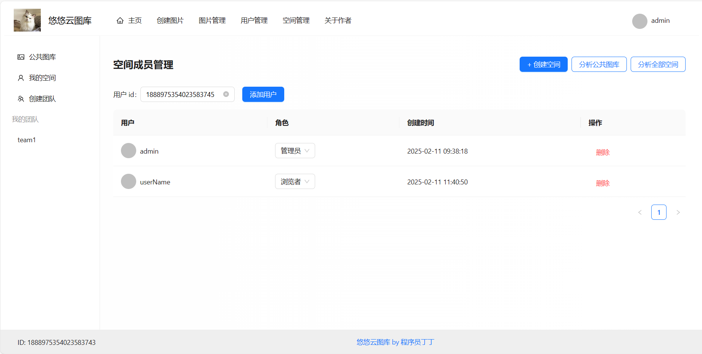
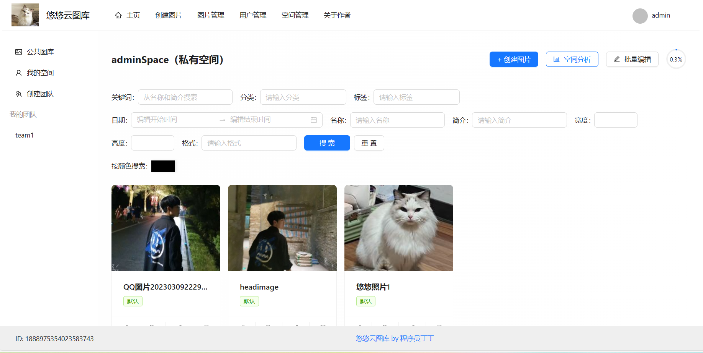
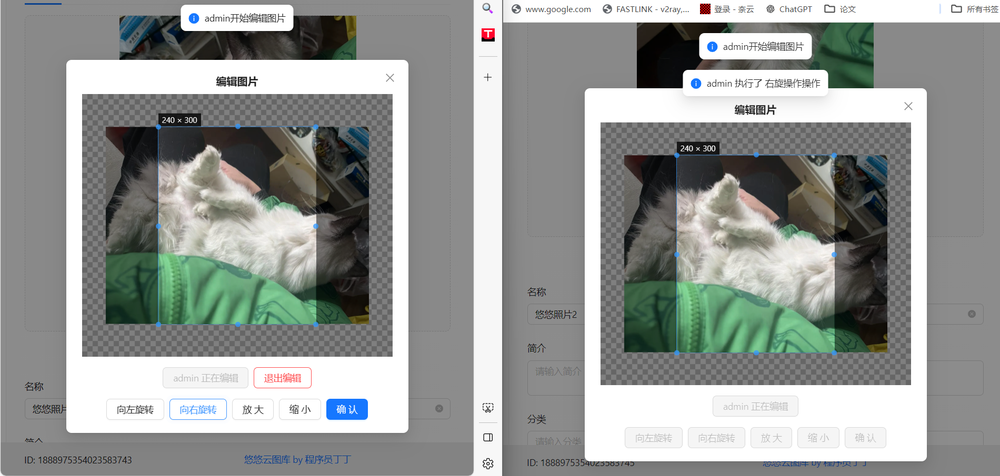
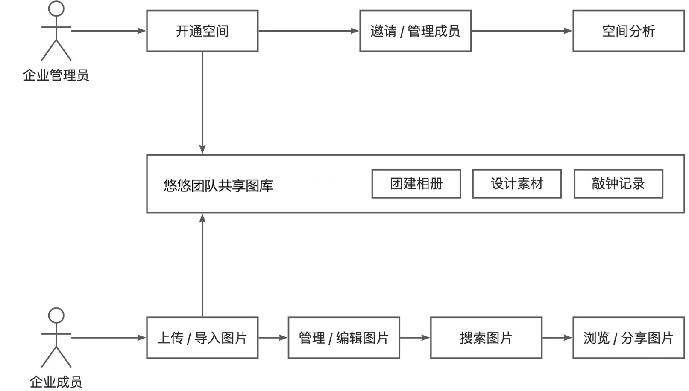
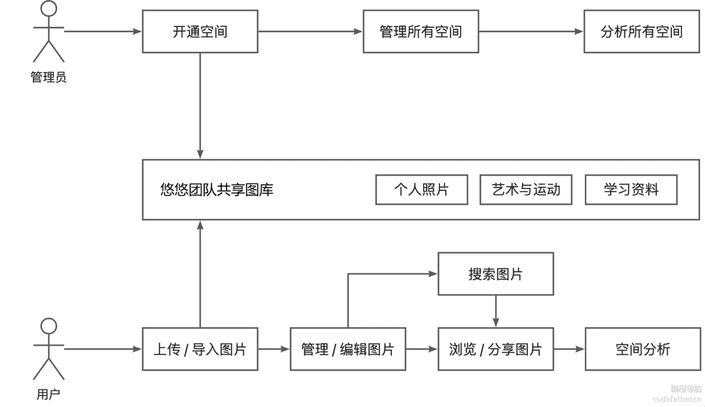
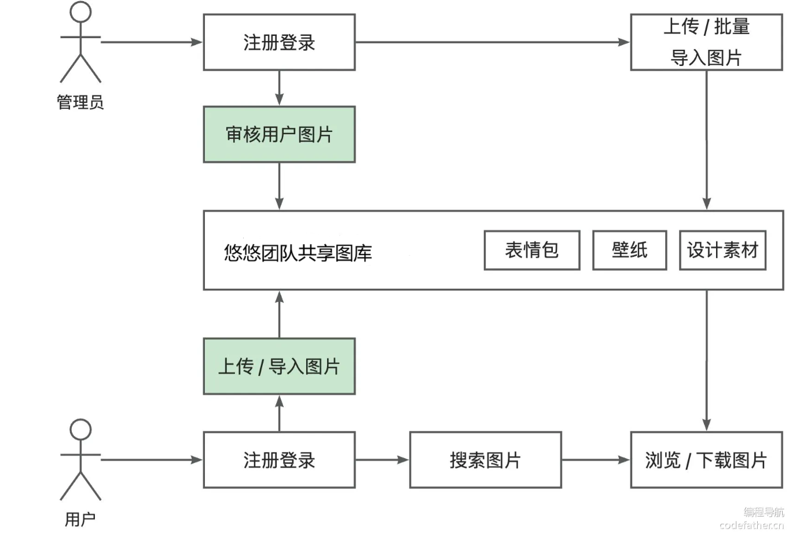
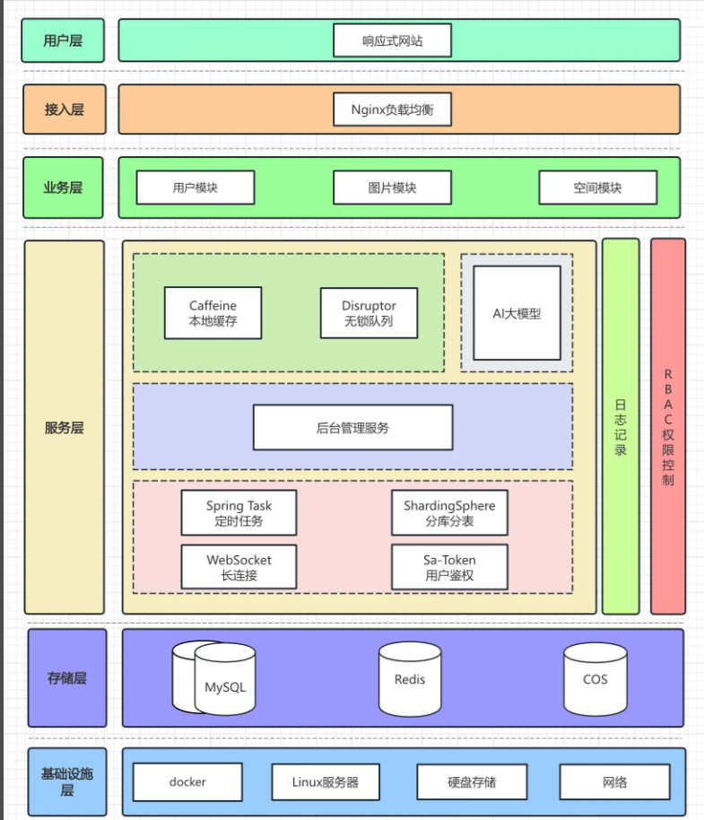

# 悠悠云图库项目介绍

视频演示和预览地址在文末

基于 Vue 3 + Spring Boot + COS + WebSocket 的 **企业级智能协同云图库平台**。

项目分为公共图库、私有图库、团队空间三大模块:

1）公共图库：任何用户都能浏览公共图库；未登录用户默认仅可查看已审核通过的图片。管理员可执行图片上传与审核，拒绝违规图片。还可以查看公共图库的图片分布情况（如分类、标签、上传趋势等）。

2）私有图库：注册用户登录后，可以将图片上传到自己的私有空间，包含多维检索、批量管理、基础编辑、AI 扩图等功能。用户还可以进行个人图库分析（图片分类、标签、大小等），从而优化存储结构或查找常用图片。

3）团队空间 企业用户或拥有付费权限的用户创建团队空间，系统会自动将创建者设为管理员；管理员可直接输入成员 ID，添加协作者并为其分配编辑者 / 浏览者角色。有编辑权限的成员可以通过 WebSocket 对图片进行协同编辑，如旋转、放大等操作会同步给其他在线成员；
平台的核心功能可分为 4 大类：

1）所有用户都可以在平台公开上传和检索图片素材，快速找到需要的图片。可用作表情包网站、设计素材网站、壁纸网站等：

2）管理员可以上传、审核和管理图片，并对系统内的图片进行分析：

3）对于个人用户，可将图片上传至私有空间进行批量管理、检索、编辑和分析，用作个人网盘、个人相册、作品集等：

4）对于企业，可开通团队空间并邀请成员，共享图片并实时协同编辑图片，提高团队协作效率。可用于提供商业服务，如企业活动相册、企业内部素材库等：

### 项目三大部分

1）第一部分，开发公共的图库平台。实战 Vue 3 + Spring Boot 图片素材网站的快速开发，学习文件存管业务的开发和优化技巧。

成果：可用作表情包网站、设计素材网站、壁纸网站等

2）第二部分，对项目 C 端功能进行大量扩展。用户可开通私有空间，并对空间图片进行多维检索、扫码分享、批量管理、快速编辑、用量分析。该部分涉及大量主流业务功能开发，能学到很多业务知识和开发经验。

成果：可用作个人网盘、个人相册、作品集等

3）第三部分，对项目 B 端功能进行大量扩展。企业可开通团队空间，邀请和管理空间成员，团队内共享图片并实时协同编辑图片。该部分涉及大量商业项目的应用场景，能学到很多架构设计和项目优化的技巧。

成果：可用于提供商业服务，如企业活动相册、企业内部素材库等

## 一、核心业务流程

### 第一部分 - 公共图库平台

### 第二部分 - 用户私有图库

### 第三部分 - 团队共享图库

## 二、项目功能

### 第一部分 - 公共图库平台

#### 用户模块

- 用户登录
- 用户注册
- 用户注销
- 用户权限控制
- 【管理员】管理用户

#### 图片模块

- 【管理员】上传创建图片
- 【管理员】图片信息编辑（标签 / 分类等）
- 【管理员】管理图片
- 查看和搜索图片列表
- 查看图片详情（进入图片详情页）
- 图片下载
- 用户上传创建图片
- 【管理员】审核图片
- 导入图片
- - 通过 URL 导入图片
  - 【管理员】批量抓取和创建图片
- 【优化】图片查询优化 - 分布式缓存、本地缓存、多级缓存
- 【优化】图片上传优化 - 压缩、秒传、分片上传、断点续传
- 【优化】图片加载优化 - 懒加载、缩略图、CDN 加速、浏览器缓存
- 【优化】图片存储优化 - 降频存储（冷热数据分离）、清理策略

### 第二部分 - 用户私有图库

#### 空间模块

- 【管理员】管理空间

- 用户开通私有空间

- 私有空间权限控制

- 空间级别和限额控制

- 空间图库分析

  - 用户空间图库分析

  - 【管理员】全空间分析

#### 图片模块

- 图片搜索
- - 基础属性搜索
  - 以图搜图
  - 颜色搜索
- 图片分享
- - 链接分享
  - 扫码分享
- 图片批量管理
- - 批量修改信息
  - 批量重命名
- 图片编辑
- - 基础图片编辑
  - AI 图片编辑

### 第三部分 - 团队共享图库

#### 空间模块

- 创建团队共享空间
- 空间成员管理
- - 成员邀请
  - 设置权限
- 空间成员权限控制

#### 图片模块

- 团队空间图片协同编辑

## 三、技术选型

### 后端

- Java Spring Boot 框架
- MySQL 数据库 + MyBatis-Plus 框架 + MyBatis X
- Redis 分布式缓存 + Caffeine 本地缓存
- Jsoup 数据抓取
- COS 对象存储
- ShardingSphere 分库分表
- Sa-Token 权限控制
- WebSocket 双向通信
- Disruptor 高性能无锁队列
- JUC 并发和异步编程
- AI 绘图大模型接入
- 多种设计模式的运用
- 多角度项目优化：性能、成本、安全性等

### 前端

- Vue 3 框架
- Vite 打包工具
- Ant Design Vue 组件库
- Axios 请求库
- Pinia 全局状态管理
- 其他组件：数据可视化、图片编辑等
- 前端工程化：ESLint + Prettier + TypeScript
- OpenAPI 前端代码生成

## 四、架构设计

# 视频演示

## 用户模块演示

用户登陆、注册、注销

管理员管理用户

[用户操作高清视频链接]()

预览：

https://github.com/user-attachments/assets/2d8ef120-d69d-4250-83cb-c0664dc159b4

## 图片基础演示

公共图片的展示、权限的校验等功能

用户图片上传、图片URL导入、图片下载

管理员审核图片、图片管理、图片批量抓取创建

[图片基础操作高清视频链接]()

预览：

https://github.com/user-attachments/assets/9ff350e1-9beb-451a-9055-2a85b674f47b

## 图片进阶演示

图片基本查看和搜索、图片颜色搜索、批量修改信息、图片编辑、AI扩图功能、私有空间图片搜索

[图片进阶操作高清视频链接]()

预览：

[https://github.com/user-attachments/assets/6467d974-9291-41b3-bec2-992481162f40](https://github.com/user-attachments/assets/80ec51fa-0601-4cfd-8ef7-1438d61421d4)

## 空间模块演示

用户开通私有空间、团队空间、个人图库分析

管理员管理空间、空间图库分析

[空间模块高清视频链接]()

预览：

https://github.com/user-attachments/assets/87dfb721-5096-4e79-8b9d-a9a03677e483

## 图片协作编辑演示

[图片协作编辑高清视频链接]()

预览：

https://github.com/user-attachments/assets/4b411a73-b912-49c8-9473-f6fdd3d12a8f

本项目还做了对私有空间、团队空间、图片访问及修改权限的校验。

网站预览：https://www.ddcoding.work/

# 主要工作

1. 基于自研的 Spring Boot 项目模板 + MyBatis Plus + MyBatis X 插件构建核心业务，实现用户、图片、空间等实体表的 CRUD 操作。
2. 使用 Spring Initializr 初始化项目，实现 MyBatis Plus、Hutool、Knife4j 接口文档、Lombok 等主流依赖整合。
3. 引入 MyBatis Plus 实现 Mapper 自动扫描，并基于其 BaseMapper + 自定义分页拦截器快速实现 CRUD 操作，减少了大量样板代码。
4. 统一异常管理：封装了自定义异常类及统一错误码枚举类，并基于 @RestControllerAdvice 注解开发全局异常处理器，提升了系统的稳定性。
5. 统一响应封装：自定义响应封装类和返回成功 / 失败响应的工具类，实现了标准化的接口响应数据格式，便于前后端交互。
6. 全局跨域配置：基于 WebMvcConfigurer 实现了全局 CORS 配置类，配置可信源，解决了前后端跨域请求问题。
7. 精度丢失解决：自定义 Jackson 配置类，通过 ObjectMapper 配置 Long 类型序列化为字符串，解决前端因 JS 精度限制导致的长整型数据精度丢失问题，确保前后端数据一致。
8. 通过 MyBatis Plus 的 LambdaQueryWrapper 和 SqlRunner 构造动态 SQL 查询，简化了操作数据库的编码。
9. 库表设计：根据业务设计用户、图片、空间、空间成员表，其中图片标签采用 JSON 数组存储，便于维护；并通过给空间成员关联表添加联合索引来提升检索性能。
10. 使用 Knife4j 自动生成接口文档，并基于 ApiOperation 注解编写接口注释，减少了人工维护文档的工作量，提高了接口可读性。
11. 用户注册：使用 MD5 + 盐值加密策略对用户密码进行加密存储，防止明文密码泄露风险。
12. 用户登录：通过 Redis 整合 Spring Session 分布式保存用户登录态，实现了跨服务器的用户识别。
13. 权限管理：基于自定义权限校验注解和 Spring AOP 环绕切面，实现了统一的权限校验，区分用户和管理员。
14. 图片存管：基于 COS 对象存储 SDK 封装了通用文件上传下载服务，并基于数据万象服务自动解析图片信息（包括宽高、格式、大小等），便于检索。
15. 图片审核：设计分级审核策略，管理员上传图片自动通过审核，并自动记录审核时间与审核人 id，确保可审计追溯。
16. URL 传图：使用 Hutool 请求 URL 来下载图片，并在下载前通过 Head 请求校验 URL，有效降低带宽消耗与数据异常风险。
17. 运用 **模板方法** 设计模式统一封装本地图片和 URL 图片上传的流程，如校验、下载、上传和资源释放，复用代码并提高可维护性。
18. 批量导图：利用 Jsoup 实现 Bing 网页图片抓取，并通过 CompletableFuture 实现批量上传和入库，性能提升 300%。
19. 查询优化：为提高主页热门图片的查询性能，采用 Redis + Caffeine 构建 **多级缓存**，接口响应耗时降低 400%，并通过随机过期时间降低缓存雪崩风险。
20. 加载优化：利用数据万象，在上传前对大文件进行 Webp 转码压缩和缩略图生成，再配合 CDN，大幅提高页面加载速度并节约成本。
21. 存储优化：利用对象存储的数据沉降功能，对 30 天未访问图片自动 **降频存储**，并开发失效图片定时清理功能，大幅节约存储成本。
22. 上传优化：为提高大文件上传效率，设计实现了基于 MD5 校验的 **图片秒传** 功能，并使用 COS SDK 实现大文件分片上传和断点续传。
23. 空间创建：基于 **分段锁** + TransactionTemplate 编程式事务实现了空间创建服务，限制每个用户最多创建一个私有空间。
24. 空间额度：通过 TransactionTemplate 编程式事务，确保上传图片到空间时会增加存储额度的占用；并通过限流和预校验机制防止存储额度超限。
25. 图片搜索：基于 MyBatis Plus 封装了将对象转换为 SQL 查询的通用方法，支持按关键词、标签、分类、时间范围等多维度组合搜索。
26. 以图搜图：通过分析请求获取到百度以图搜图 API，利用 Jsoup 和 HttpClient 调用 API，并运用 **门面模式** 组合 API 调用来获取图片列表，便于客户端使用。
27. 颜色搜图：使用数据万象提取图片主色调并存储到数据库，搜索时通过欧氏距离计算颜色相似度并通过 Stream API 进行排序。
28. 批量编辑：通过 Transactional 事务管理确保批量编辑图片的原子性；并利用 ThreadPoolExecutor + 数据库批处理进一步优化了批处理性能。
29. AI 扩图：基于阿里云百炼大模型封装 AI 绘图服务，提供创建与查询任务的 API，采用异步任务轮询处理进度，并统一错误码以提升稳定性。
30. 空间分析：运用 group by 实现数据的聚合统计，并通过 MyBatis Plus 的 selectObjs 方法按需选择字段，提高查询性能并节约内存占用。
31. 成员管理：设计 space_user 关联表保存团队空间成员及角色信息，使用唯一联合索引防止成员重复加入，同时提升查询性能。
32. 运用 @Lazy 注解，解决了空间服务和空间成员服务互相引用导致的循环依赖问题。
33. 权限管理：基于 Sa-Token 的 Kit 模式实现了多账号体系的 **RBAC 权限控制**，通过从请求上下文中获取参数实现了统一的权限校验逻辑，并运用注解合并简化了鉴权注解的使用，轻松实现方法级别的权限校验。
34. 数据分表：使用 ShardingSphere 自定义分表算法实现了团队空间图片的 **动态分表**，提高了查询效率。并且为了通过框架内置的校验规则，手动维护可用分表节点。
35. 协作编辑：基于 WebSocket + **事件驱动设计** 实现多人协作编辑图片功能，自定义握手拦截器确保权限校验通过后才能连接，并通过 “编辑锁” 机制，避免编辑冲突。
36. 协作优化：基于 **Disruptor 无锁队列** 实现了 WebSocket 消息的异步化处理，显著提升系统吞吐量；并结合 @PreDestroy 注解实现优雅停机，防止编辑操作丢失。
37. 架构升级：随着项目代码量增大，引入领域驱动设计 DDD，将业务逻辑按子域拆分，优化了代码结构与可扩展性。
38. 部署上线：通过宝塔 Linux 的 Java 项目管理器部署 jar 包，并通过 Nginx 配置反向代理解决跨域问题。

/assets/a2482b30-ee53-4faf-8a38-7f51d3a06a7a" controls width="100%"></video>
