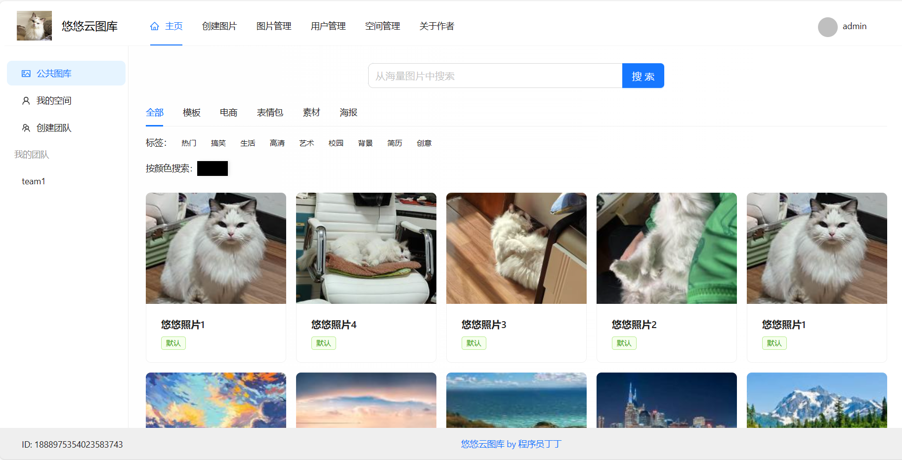
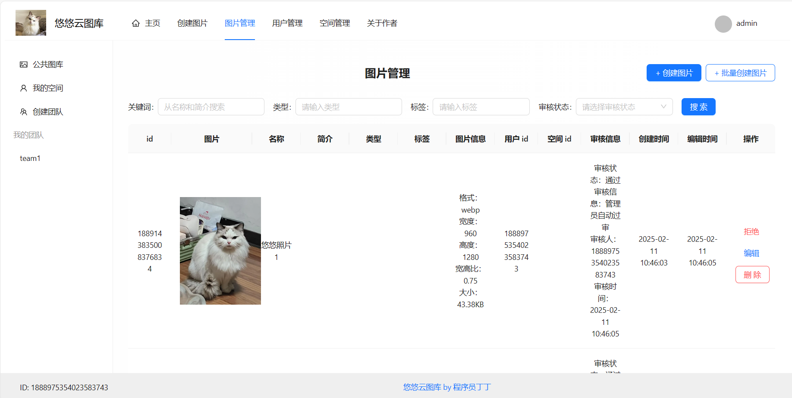
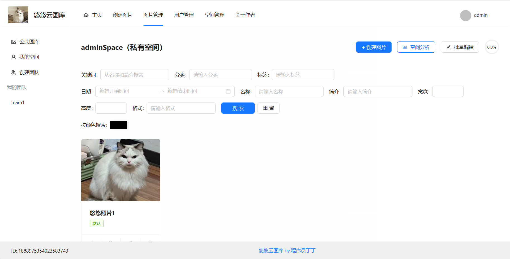
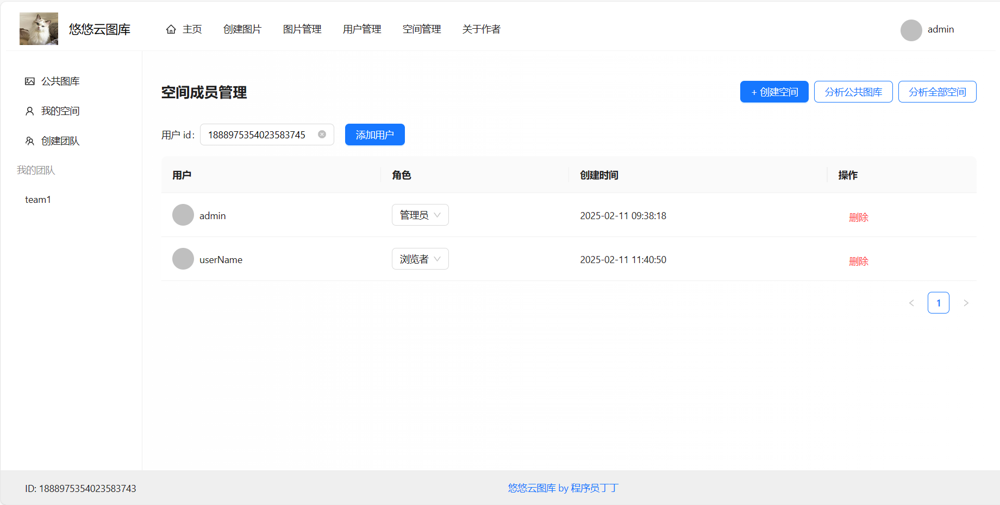
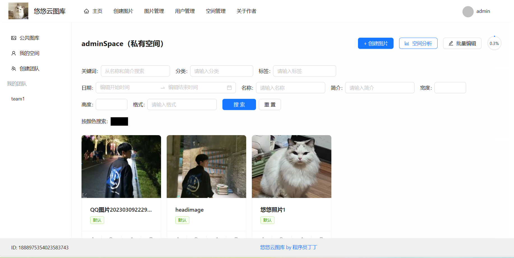
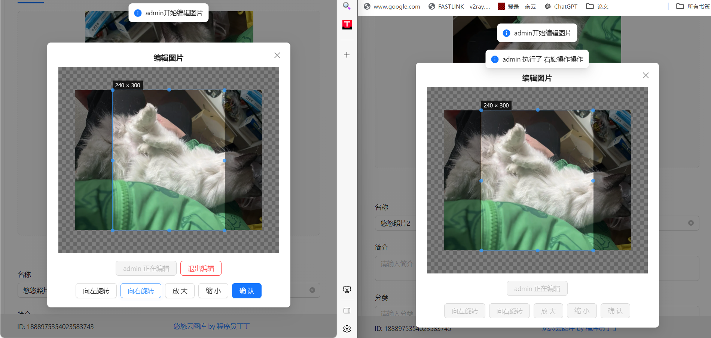
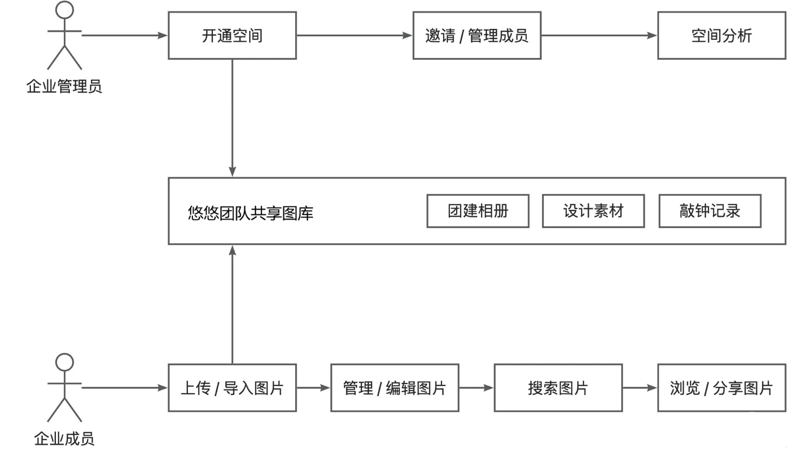
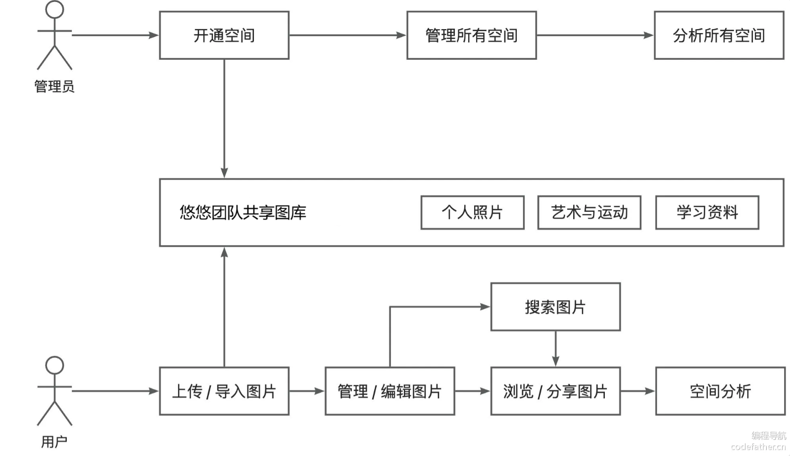
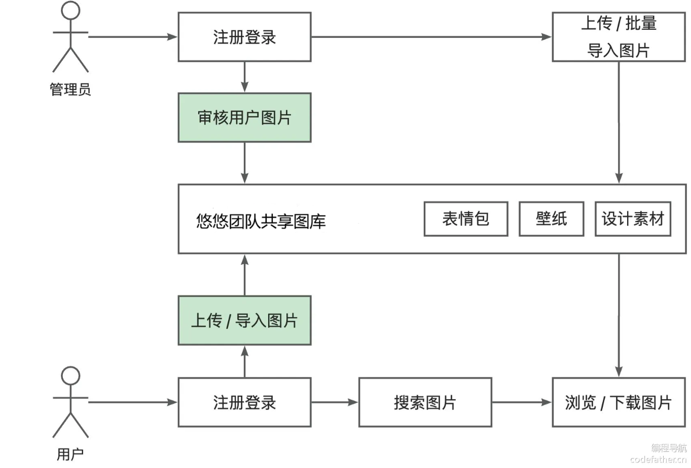
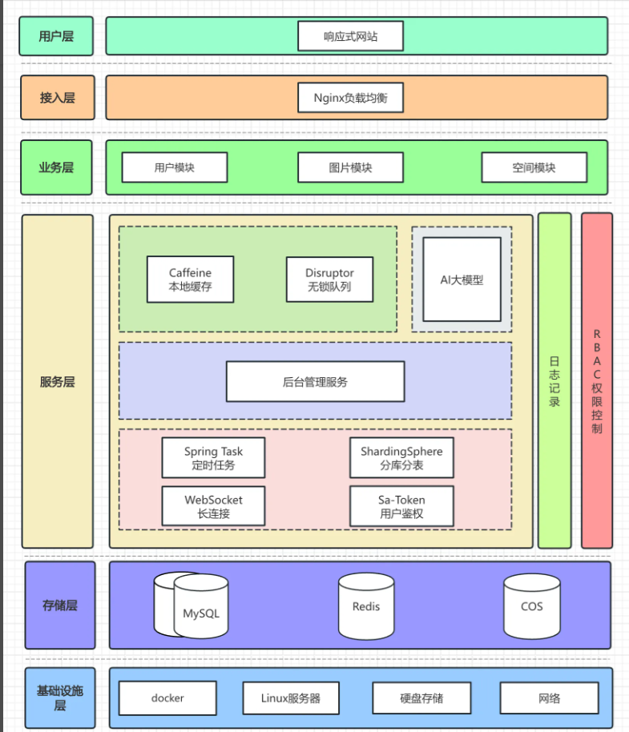

# 悠悠云图库项目介绍
视频演示和预览地址在文末

基于 Vue 3 + Spring Boot + COS + WebSocket 的 **企业级智能协同云图库平台**。

平台的核心功能可分为 4 大类：

1）所有用户都可以在平台公开上传和检索图片素材，快速找到需要的图片。可用作表情包网站、设计素材网站、壁纸网站等：

2）管理员可以上传、审核和管理图片，并对系统内的图片进行分析：

3）对于个人用户，可将图片上传至私有空间进行批量管理、检索、编辑和分析，用作个人网盘、个人相册、作品集等：

4）对于企业，可开通团队空间并邀请成员，共享图片并实时协同编辑图片，提高团队协作效率。可用于提供商业服务，如企业活动相册、企业内部素材库等：

### 项目三大部分

1）第一部分，开发公共的图库平台。实战 Vue 3 + Spring Boot 图片素材网站的快速开发，学习文件存管业务的开发和优化技巧。

成果：可用作表情包网站、设计素材网站、壁纸网站等

2）第二部分，对项目 C 端功能进行大量扩展。用户可开通私有空间，并对空间图片进行多维检索、扫码分享、批量管理、快速编辑、用量分析。该部分涉及大量主流业务功能开发，能学到很多业务知识和开发经验。

成果：可用作个人网盘、个人相册、作品集等

3）第三部分，对项目 B 端功能进行大量扩展。企业可开通团队空间，邀请和管理空间成员，团队内共享图片并实时协同编辑图片。该部分涉及大量商业项目的应用场景，能学到很多架构设计和项目优化的技巧。

成果：可用于提供商业服务，如企业活动相册、企业内部素材库等

## 一、核心业务流程

### 第一部分 - 公共图库平台

### 第二部分 - 用户私有图库

### 第三部分 - 团队共享图库

## 二、项目功能

### 第一部分 - 公共图库平台

#### 用户模块

- 用户登录
- 用户注册
- 用户注销
- 用户权限控制
- 【管理员】管理用户

#### 图片模块

- 【管理员】上传创建图片
- 【管理员】图片信息编辑（标签 / 分类等）
- 【管理员】管理图片
- 查看和搜索图片列表
- 查看图片详情（进入图片详情页）
- 图片下载
- 用户上传创建图片
- 【管理员】审核图片
- 导入图片
- - 通过 URL 导入图片
  - 【管理员】批量抓取和创建图片
- 【优化】图片查询优化 - 分布式缓存、本地缓存、多级缓存
- 【优化】图片上传优化 - 压缩、秒传、分片上传、断点续传
- 【优化】图片加载优化 - 懒加载、缩略图、CDN 加速、浏览器缓存
- 【优化】图片存储优化 - 降频存储（冷热数据分离）、清理策略

### 第二部分 - 用户私有图库

#### 空间模块

- 【管理员】管理空间

- 用户开通私有空间

- 私有空间权限控制

- 空间级别和限额控制

- 空间图库分析

  - 用户空间图库分析

  - 【管理员】全空间分析

#### 图片模块

- 图片搜索
- - 基础属性搜索
  - 以图搜图
  - 颜色搜索
- 图片分享
- - 链接分享
  - 扫码分享
- 图片批量管理
- - 批量修改信息
  - 批量重命名
- 图片编辑
- - 基础图片编辑
  - AI 图片编辑

### 第三部分 - 团队共享图库

#### 空间模块

- 创建团队共享空间
- 空间成员管理
- - 成员邀请
  - 设置权限
- 空间成员权限控制

#### 图片模块

- 团队空间图片协同编辑

## 三、技术选型

### 后端

- Java Spring Boot 框架
- MySQL 数据库 + MyBatis-Plus 框架 + MyBatis X
- Redis 分布式缓存 + Caffeine 本地缓存
- Jsoup 数据抓取
- COS 对象存储
- ShardingSphere 分库分表
- Sa-Token 权限控制
- WebSocket 双向通信
- Disruptor 高性能无锁队列
- JUC 并发和异步编程
- AI 绘图大模型接入
- 多种设计模式的运用
- 多角度项目优化：性能、成本、安全性等

### 前端

- Vue 3 框架
- Vite 打包工具
- Ant Design Vue 组件库
- Axios 请求库
- Pinia 全局状态管理
- 其他组件：数据可视化、图片编辑等
- 前端工程化：ESLint + Prettier + TypeScript
- OpenAPI 前端代码生成

## 四、架构设计

# 视频演示

## 用户模块演示

用户登陆、注册、注销

管理员管理用户

[用户操作高清视频链接]()

预览：

https://github.com/user-attachments/assets/b62993c8-3013-4c9b-a321-2d0cc4d41a48

## 图片基础演示

公共图片的展示、权限的校验等功能

用户图片上传、图片URL导入、图片下载

管理员审核图片、图片管理、图片批量抓取创建

[图片基础操作高清视频链接]()

预览：

https://github.com/user-attachments/assets/7f149bce-7d10-4663-902f-c21bc768280a

## 图片进阶演示

图片基本查看和搜索、图片颜色搜索、批量修改信息、图片编辑、AI扩图功能、私有空间图片搜索

[图片进阶操作高清视频链接]()

预览：

https://github.com/user-attachments/assets/6467d974-9291-41b3-bec2-992481162f40

## 空间模块演示

用户开通私有空间、团队空间、个人图库分析

管理员管理空间、空间图库分析

[空间模块高清视频链接]()

预览：

https://github.com/user-attachments/assets/cd297df2-6cd5-46dc-bbe2-67df0de00470

## 图片协作编辑演示

[图片协作编辑高清视频链接]()

预览：

https://github.com/user-attachments/assets/c04273f2-7b60-4ea4-8f08-a6e7ce6d7050

本项目还做了对私有空间、团队空间、图片访问及修改权限的校验。

网站预览：

